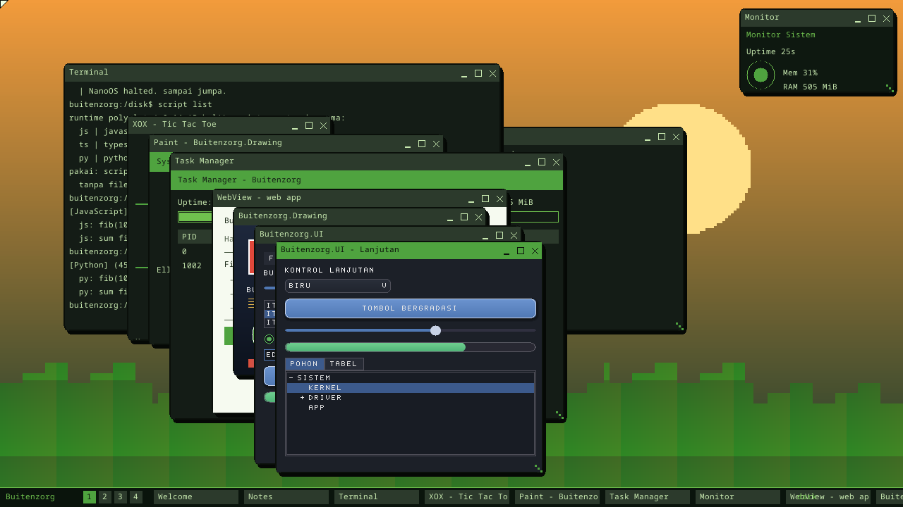

# Buitenzorg OS

[English](README.md) · **Bahasa Indonesia**

> **Sistem operasi hibrida & AI-native**: kernel dan driver **Rust** ("dunia
> unsafe"), lapisan aplikasi, UI, & AI **C#/.NET** ("dunia managed"). Ditulis
> dari nol untuk x86-64.
>
> *Codename **Buitenzorg** — nama Belanda lama untuk Bogor, "tanpa kekhawatiran"
> (zonder zorg). Dibuat oleh [Gravicode Studios](#kredit), dipimpin oleh Kang
> Fadhil.*

**`Status: v0.1–v0.16 selesai` · `stabilisasi v1.0 berjalan` · `Lisensi: MIT`**

Baru mulai? Mulai dari **[Tutorial](docs/tutorial.id.md)**. Indeks dokumentasi
lengkap: **[docs/](docs/README.id.md)**. Riwayat rilis: **[CHANGELOG](CHANGELOG.md)** *(EN)*.

> 🌐 Dokumen yang dibaca pengguna (README, `docs/`) tersedia dalam **English**
> dan **Bahasa Indonesia**. Spec teknis otoritatif **[requirements.md](requirements.md)**
> serta tracker **[PLAN.md](PLAN.md)** / **[Progress.md](Progress.md)** dipelihara
> dalam **Bahasa Indonesia**.


---

## Daftar Isi

- [Apa itu Buitenzorg?](#apa-itu-buitenzorg)
- [Status singkat](#status-singkat)
- [Tangkapan layar](#tangkapan-layar)
- [Quickstart](#quickstart)
- [Dokumentasi](#dokumentasi)
- [Arsitektur](#arsitektur)
- [Struktur repo](#struktur-repo)
- [Roadmap](#roadmap)
- [Berkontribusi](#berkontribusi)
- [Kredit & Lisensi](#kredit)

---

## Apa itu Buitenzorg?

Buitenzorg adalah **OS AI-native yang cenderung microkernel**, dibangun di atas
pembagian tanggung jawab yang tegas:

- **Rust (`no_std`, ring 0)** — bootloader, kernel, manajer memori, scheduler,
  interrupt, dan driver hardware.
- **C#/.NET (ring 3)** — layanan sistem, window manager & desktop, subsistem AI,
  SDK, dan aplikasi. Strategi runtime: NativeAOT dulu, CoreCLR/JIT menyusul.
- **AI-native** — LLM lokal, computer vision, dan generative AI adalah layanan
  tingkat-OS (bukan aplikasi tambahan), dengan Model Manager gaya Hugging Face.
- **Aplikasi polyglot** — satu model aplikasi, empat varian (console, desktop,
  web, widget), bisa ditulis dalam C#, JavaScript, TypeScript, atau Python.

Berbeda dari Cosmos (kernel C# lewat IL2CPU), Buitenzorg menjaga kernel tetap di
Rust dan memberi C# runtime .NET penuh di user-space. Sambungan paling krusial
adalah **ABI Rust ↔ C#** (`kernel/abi` ↔ `runtime/Buitenzorg.Runtime/Sys`) —
tabel syscall bernomor yang stabil, dijaga test kontrak identik di kedua sisi.

## Status singkat

Setiap milestone diverifikasi di QEMU pada **empat media boot (IDE / AHCI /
NVMe / USB)** lewat marker `MILESTONE: … OK` yang dicek smoke test.

| Versi | Codename | Sorotan |
|---|---|---|
| v0.1–0.4 | Benih → Tunas | Boot (BIOS+UEFI) · memori/paging/heap · scheduler · syscall ABI · IPC · PCI · IDE+FAT · **C# di ring 3** |
| v0.5–0.7 | Dahan → Kanopi | VFS + FAT write · service manager · async I/O · jaringan · compositor + window manager · desktop, terminal, tema, workspace |
| v0.8–0.10 | Kembang → Buah | App framework + window syscall · 4 varian app · `Buitenzorg.Drawing` · Task Manager · theme engine (8 tema) · package manager |
| v0.11–0.12 | Cahaya → Nalar | Compute API · screensaver · kontrol window · **subsistem AI** (LLM + CV + GenAI + Model Manager) · power management |
| v0.13–0.14 | Lapis → Babel | **Virtualisasi** (VMM software menjalankan guest OS + snapshot) · **runtime polyglot** (JS / TS / Python) |
| v0.15 | Matang | **Managed runtime C#** — heap berfungsi + `Buitenzorg.Bcl` (koleksi, LINQ, System.IO/Text/Regex/Net/Tasks, …) |
| v0.16 | Panen | **Audio AC'97** · toolkit `Buitenzorg.UI` · **8 app bawaan** · desktop shell (start menu + jam tray) · decoder JPEG |
| **v1.0** | Buitenzorg | *Berjalan* — security hardening, pembekuan ABI, debugger GDB + profiler, benchmark CI, image USB/VM, lisensi MIT |

<details>
<summary><b>Contoh boot log</b> (output serial, klik untuk buka)</summary>

```
[kernel] Hello Kernel -- Buitenzorg OS v0.1 'Benih'
[kernel] MILESTONE: HELLO KERNEL OK
[kernel] MILESTONE: MEMORY OK
[kernel] MILESTONE: SYSCALL ABI V1 OK
[kernel] MILESTONE: SCHEDULER OK (two tasks alternated preemptively)
[kernel] MILESTONE: IPC OK (3 messages, checksum verified)
[kernel] MILESTONE: PCI OK (6 devices enumerated)
[kernel] MILESTONE: STORAGE OK (file read from disk via IDE PIO + FAT)
[kernel] MILESTONE: TUNAS OK (C# ran in ring 3 -> 'Hello from C#!')
[kernel] MILESTONE: VFS OK (FAT write + read-back verified on /ram)
[kernel] MILESTONE: SERVICES OK (dependency-ordered parallel init)
[aio] 2001 ops in <1 tick (>36418 ops/sec)
[kernel] MILESTONE: ASYNC IO OK (io_uring-style SQ/CQ, benchmark-able)
[kernel] MILESTONE: NETWORK OK (Ethernet/ARP/IPv4/ICMP stack)
[kernel] MILESTONE: WINDOWS OK (two windows moved & resized)
[kernel] MILESTONE: KANOPI OK (desktop environment: terminal, theme, multi-desktop)
[kernel] MILESTONE: SERBUK OK (System.Drawing library + Task Manager + 4 app variants)
[kernel] MILESTONE: BUAH OK (theme engine + 8 styles + package manager)
[kernel] MILESTONE: CAHAYA OK (GPU compute + window controls + screensaver + personalization)
[kernel] MILESTONE: NALAR OK (AI subsystem + power management)
[kernel] MILESTONE: LAPIS OK (virtualization: software VMM + guest OS)
[kernel] MILESTONE: BABEL OK (polyglot runtime: JS/TS/Python)
[kernel] MILESTONE: BCL OK (Buitenzorg.Bcl) / BCL2 OK (System.IO/Text/Regex/Net/...)
[kernel] MILESTONE: AUDIO OK (AC'97 mixer + PCM) / UI OK / DRAW OK / JPEG OK
[kernel] MILESTONE: SUITE OK (8 preloaded apps) / DESKTOP SHELL OK
[kernel] MILESTONE: SECURITY OK (syscall pointer validation) / PROFILER OK
[kernel] BUITENZORG READY -- terminal ('run calc', 'prof self', 'ask ...', 'vm start nanovm').
```
</details>

## Tangkapan layar

| | |
|---|---|
| **Desktop shell** — start menu, taskbar, jam tray live, window aplikasi | **Toolkit UI** — kontrol `Buitenzorg.UI` |
| [](docs/img/desktop-shell.png) | [](docs/img/desktop-ui.png) |
| **Jam** — analog + digital, waktu CMOS nyata | **2048** — game bawaan |
| [](docs/img/desktop-clock.png) | [](docs/img/desktop-2048.png) |
| **Subsistem AI** — LLM lokal + galeri model (v0.12 "Nalar") | **Screensaver** — Mystify, gaya Win 3.1/98 |
| [](docs/img/desktop-nalar.png) | [](docs/img/screensaver-mystify.png) |

**MagicAppGen** — generator app AI sisi-host (`tools/MagicAppGen`) yang menulis
aplikasi Buitenzorg dari sebuah prompt:

[](docs/img/magicappgen.png)

Lebih banyak tangkapan layar tersebar di seluruh [dokumentasi](docs/README.id.md).

## Quickstart

**Prasyarat**

| Alat | Versi | Catatan |
|---|---|---|
| Rust (rustup) | nightly (dipin oleh `kernel/rust-toolchain.toml`) | target `x86_64-unknown-none` |
| .NET SDK | 10.0+ | runtime, SDK, `bz` CLI |
| QEMU | `qemu-system-x86_64` | emulator utama |

**Jalur tercepat (tanpa setup):** satu skrip memasang semuanya (Rust, .NET,
QEMU, bflat), build, lalu boot di QEMU:

```powershell
.\scripts\quickstart.ps1     # Linux/macOS: ./scripts/quickstart.sh
```

**Alur harian** (dependensi sudah terpasang):

```powershell
.\scripts\build.ps1          # build kernel + image boot + .NET  → dist/
.\scripts\run-qemu.ps1       # boot di QEMU (grafis + serial); tambah -Uefi untuk UEFI
.\scripts\smoke-test.ps1     # boot headless, assert marker milestone

cd kernel; cargo test -p bz-abi     # test kontrak ABI sisi Rust
dotnet test Buitenzorg.slnx         # test kontrak ABI + manifest sisi C#
dotnet run --project sdk\bz -- new console-csharp MyApp   # scaffold app
```

Boot media tertentu dengan `cargo run --release -p bzimage -- --run --media nvme`
(`ide` / `ahci` / `nvme` / `usb`). Setup lengkap & troubleshooting:
**[Getting Started](docs/getting-started.id.md)**.

## Dokumentasi

Indeks lengkap & terorganisir ada di **[docs/README.id.md](docs/README.id.md)**.
Sorotan:

| Dokumen | Untuk |
|---|---|
| **[Tutorial](docs/tutorial.id.md)** | Panduan nol→app — **mulai di sini** |
| [Getting Started](docs/getting-started.id.md) | Setup, dependensi, alur harian, troubleshooting |
| [App Pertama](docs/first-app.id.md) | Bikin app + katalog library bawaan |
| [Jalankan di VM](docs/run-in-vm.id.md) | VMware, VirtualBox, Hyper-V |
| [Pasang di Hardware](docs/install-hardware.id.md) | Tulis ke USB & boot mesin fisik |
| [Debugging & Profiling](docs/debugging.id.md) | Attach GDB + profiler zona TSC |
| [Syscall ABI](docs/abi.id.md) | Tabel ABI v1 & aturan evolusinya |
| [CHANGELOG](CHANGELOG.md) *(EN)* · [CONTRIBUTING](CONTRIBUTING.md) *(EN)* | Riwayat rilis · cara berkontribusi |

## Arsitektur

Sepuluh layer, dari bawah ke atas (lihat [requirements.md](requirements.md) §3):

```
Hardware → Bootloader (Rust) → Kernel (Rust, ring 0) → Driver →
Managed Runtime (.NET — jembatan kritis) → System Services (C#) →
Subsistem AI (C#) → Desktop Environment (C#) → App Framework (polyglot) → Aplikasi
```

**Aturan interop** (§4) adalah jantung desain: semua panggilan lintas-bahasa
lewat C ABI; hanya primitif, pointer, dan struct `#[repr(C)]` yang menyeberang;
nomor syscall membentuk tabel stabil append-only; data besar (framebuffer, file,
tensor) memakai shared memory zero-copy; dan objek managed di-pin GC selama Rust
memegang pointer-nya. Sisi kernel (`kernel/abi`) dan mirror C#
(`runtime/Buitenzorg.Runtime/Sys`) dijaga selaras oleh test kontrak identik —
ubah satu sisi tanpa sisi lain, test langsung merah.

## Struktur repo

```
kernel/            Rust workspace (nightly, no_std)
  abi/               bz-abi — kontrak syscall ABI v1 (sumber kebenaran)
  bzkernel/          kernel ring-0: boot, console, GDT/IDT, memori, heap, syscall, driver
  bzimage/           builder image boot (UEFI + BIOS) + runner QEMU
runtime/           dunia managed C#
  Buitenzorg.Runtime/        mirror ABI, backend syscall, app manifest
  Buitenzorg.Runtime.Tests/  test kontrak ABI + manifest
  samples/                   HelloBuitenzorg (sample host-sim)
userland/          program ring-3 (C# bflat/zerolib + shim bzstart.rs → *.elf)
sdk/               bz CLI + template app + ekstensi VS Code
tools/             toolchain pihak ketiga (bflat) — di-gitignore
ai/  apps/         subsistem AI (v0.12) · suite bawaan (v0.16)
docs/  scripts/  dist/   dokumentasi · skrip build & run · output image (di-gitignore)
```

## Roadmap

- **[PLAN.md](PLAN.md)** — roadmap produk, per-versi (v0.1 → v1.x). *(ID)*
- **[Progress.md](Progress.md)** — tracker checklist per-fitur. *(ID)*
- **[requirements.md](requirements.md)** — spec teknis penuh; §16 roadmap, §17 checklist. *(ID)*

## Berkontribusi

Lihat **[CONTRIBUTING.md](CONTRIBUTING.md)** *(EN)* untuk standar koding & alur
PR. Aturan emas: **setiap perubahan ABI harus menyentuh kedua sisi + kedua suite
test kontrak + `docs/abi.md` dalam satu perubahan**, dan nomor syscall
append-only.

## Kredit

**Buitenzorg OS** dibuat oleh **Gravicode Studios**, dipimpin oleh **Kang
Fadhil**. Atribusi ini juga tampil di dalam OS — boot logo, window **Welcome**
desktop, dan perintah shell `ver` / `about`.

## Lisensi

Dirilis di bawah **Lisensi MIT** — lihat [LICENSE](LICENSE).
© 2026 Gravicode Studios.
