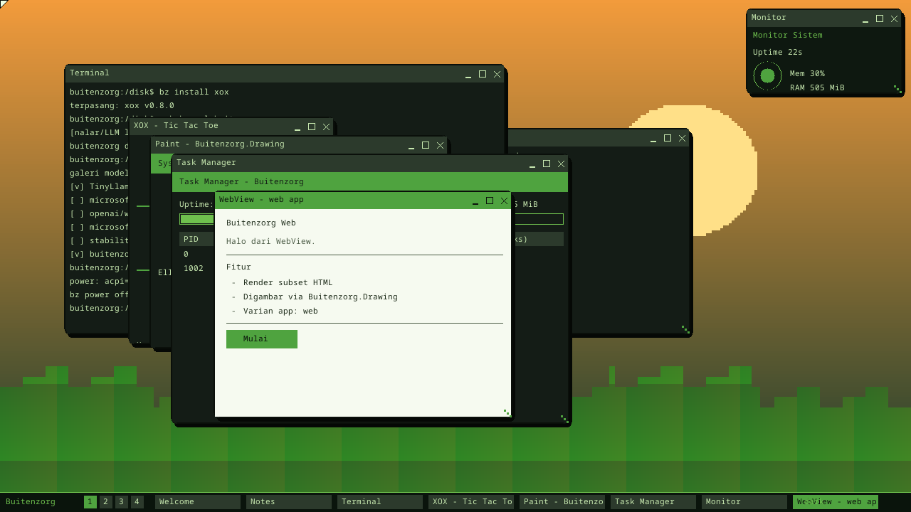

# AI Subsystem & Power Management (v0.12 "Nalar")

**English** · [Bahasa Indonesia](ai-power.id.md) · ← [Documentation index](README.md)

## AI Subsystem (`ai.rs`, `model.rs`)

AI as a system service (requirements.md §6), scaled down to run offline on the
kernel/CPU (a production LLM needs GGUF/ONNX models + a GPU/NPU — backlog).

- **AI System API** (`ai.rs`):
  - `llm_complete(prompt, n)` — **a real char-level bigram model**: trained on a
    small corpus (character→character statistics), then generates text. A genuine
    local LLM, just at toy scale.
  - `vision_edges(gray, w, h, thr)` — **Sobel** edge detection (computer vision).
  - `genai_image(prompt, w, h)` — procedural text-to-image (hash the prompt → a
    pattern).
  - Shell: `ask <prompt>`.
- **Model Manager** (`model.rs`): a **Hugging Face-style** gallery with metadata
  (task, size, VRAM, license, format): TinyLlama, phi-2, whisper, trocr,
  sd-turbo, plus the built-in `buitenzorg/nalar-bigram`. `bz model list/pull/info`
  ("pull" registers a model as available offline; downloading real weights is
  backlog).
- Verification: `ai::selftest` runs all three → `AI OK`.

## Power Management (`power.rs`)

Shutdown / Restart / Sleep, via ACPI with a VM fallback.

- **ACPI parser**: the RSDP (from the bootloader's `BootInfo.rsdp_addr`) →
  RSDT/XSDT → FADT → `PM1a_CNT_BLK`, `RESET_REG`; scan the DSDT for the `\_S5`
  package (SLP_TYPa).
- **Shutdown** — write `SLP_TYPa | SLP_EN` to PM1a_CNT; fall back to the QEMU
  ports (0x604/0xB004) and VirtualBox (0x4004). **Verified: QEMU powers off
  (exit 0).**
- **Restart** — the ACPI reset register (if present); fall back to a
  keyboard-controller reset pulse (`0x64 ← 0xFE`); a triple-fault (null IDT +
  int3) as a last resort.
- **Sleep** — a *light sleep*: blank the framebuffer + `hlt` until there is
  mouse/keyboard input (ACPI S3 suspend-to-RAM is backlog).
- Shell: `shutdown`, `restart`/`reboot`, `sleep`; `bz power off|restart|sleep`;
  `bz power` shows the ACPI status.

> To verify shutdown without breaking a normal boot: temporarily add
> `power::shutdown()` at the end of `nalar_demo`, boot, confirm QEMU exits on its
> own, then remove it (do not leave it in — it kills normal boot and the smoke
> test).

## What's next

A production-scale LLM (GGUF/ONNX on a GPU/NPU) + an inference scheduler, CV/GenAI
audio-video, real model downloads + a sandbox, ACPI S3, a power-menu GUI +
confirmation, and flush/save-state before a power change.

---

← [Documentation index](README.md) · *Buitenzorg OS — made by Gravicode Studios, led by Kang Fadhil.*
