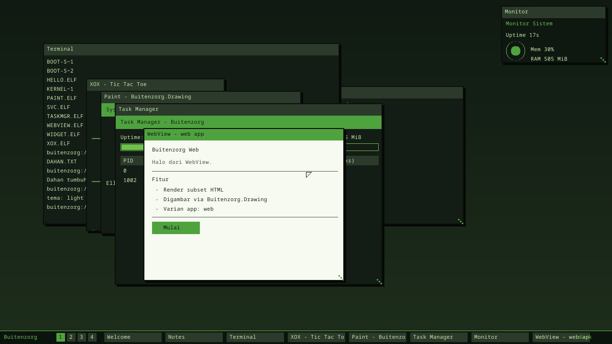

# App Framework (v0.8 "Kembang")

Milestone v0.8: **"desktop app pihak-ketiga jalan"** — sebuah app C# gaya
pihak-ketiga membuat window sendiri dan menggambar UI-nya lewat syscall.

[English](app-framework.md) · **Bahasa Indonesia** · ← [Indeks dokumentasi](README.id.md)

## Window syscall ABI (append-only, v0.8)

Ditambahkan ke kontrak `bz-abi` ↔ C# (lihat [Syscall ABI](abi.id.md)):

| # | Nama | Argumen | Hasil |
|---|---|---|---|
| 6 | `WIN_CREATE` | a0=title ptr, a1=len, a2=(w≪32)\|h | window id |
| 7 | `WIN_CMD` | a0=window id, a1=ptr ke `DrawCmd` | 0 = sukses |
| 8 | `WIN_PRESENT` | a0=window id | 0 (recompose desktop) |
| 9 | `KEY_READ` | — | 1 char (0 bila kosong) |

`DrawCmd` (`#[repr(C)]`, 48 byte) berisi op (fill_rect / draw_text / clear),
koordinat, warna `0x00RRGGBB`, dan pointer + len teks. Test kontrak ukuran ada di
kedua sisi (`cargo test -p bz-abi`, `AbiContractTests.cs`).

## Alur

1. App C# (mis. `userland/hello-csharp/xox.cs`) memanggil `bz_win_create`,
   `bz_win_cmd`, `bz_win_present` (disediakan `bzstart.rs` sebagai fungsi
   `#[no_mangle]` yang membungkus syscall Buitenzorg).
2. Kernel `create_app_window` membuat `Window` dengan `AppCanvas` (buffer piksel
   client area). `draw_on_window` menerapkan `DrawCmd` ke canvas.
3. Compositor mem-blit `AppCanvas` ke framebuffer saat window dikomposit.
4. Shell `run <app>` (`app::run_named`) membaca `<APP>.ELF` dari `/disk`,
   memuatnya via ELF loader, dan menjalankannya di ring 3 (load → run → unmap).

## SDK & tooling

- Template: `sdk/templates/console-csharp`, `sdk/templates/desktop-csharp` (dengan
  helper `bzui.cs`, `app.manifest`, `.vscode/launch.json`).
- `bz new desktop-csharp <nama>` men-scaffold app baru.
- `sdk/vscode-extension` — skeleton ekstensi VS Code (§13.1): New Project, Build &
  Run in QEMU, Validate Manifest, plus tipe debug `buitenzorg`.

## Batasan: tanpa GC (lihat CLAUDE.md)

App freestanding (zerolib, tanpa GC). **Sejak v0.15 heap berfungsi** (`new`,
array, generic), tapi aturan zerolib tetap berlaku — tanpa static reference field,
tanpa method-group→delegate, tanpa store elemen `object[]`, tanpa `ToString()` /
concat. Lihat [App Pertama](first-app.id.md) untuk aturan lengkapnya.

## v0.9 "Serbuk": Drawing, Task Manager, 4 varian app

- **`Buitenzorg.Drawing`** (`userland/hello-csharp/bzdraw.cs`) — library grafik
  managed gaya System.Drawing: `Graphics`, `Pen`, `Brush`, `Color`, `Point`,
  `Rectangle`, `Size`; `FillRectangle`/`DrawRectangle`, `DrawLine`,
  `DrawEllipse`/`FillEllipse`, `DrawString`/`DrawChars`. Menerjemahkan ke draw op
  window ABI baru (LINE=3, ELLIPSE=4, FILL_ELLIPSE=5, RECT=6). Demo: `paint.cs`.
  *(Renderer sisi-klien v0.16 `bzgfx.cs` menggantikan ini — lihat
  [App Pertama](first-app.id.md).)*
- **Task Manager** (`taskmgr.cs`) — daftar proses (kernel task + app aktif),
  uptime/heap/RAM, dan kill. Didukung registry proses kernel (`process.rs`) dengan
  akuntansi CPU-time per-tick + syscall `PROC_LIST`/`PROC_KILL`/`SYS_STAT`.
- **Varian app**: **widget** (`widget.cs`, ter-dock di widget board lewat prefix
  judul `widget:`) dan **web view** (`webview.cs`, renderer subset-HTML) —
  melengkapi console/desktop, jadi keempat varian app berjalan.

## Berikutnya

Toolkit UI berbasis XAML (binding/MVVM) — telah terwujud sebagai `Buitenzorg.UI`
retained-mode di v0.16 — engine web HTML/CSS/JS penuh, tab + Details di Task
Manager, template SDK web/widget, debugging DAP dari VS Code + debug bridge, dan
CoreCLR/JIT + GC.

---

← [Indeks dokumentasi](README.id.md) · *Buitenzorg OS — dibuat oleh Gravicode Studios, dipimpin oleh Kang Fadhil.*
