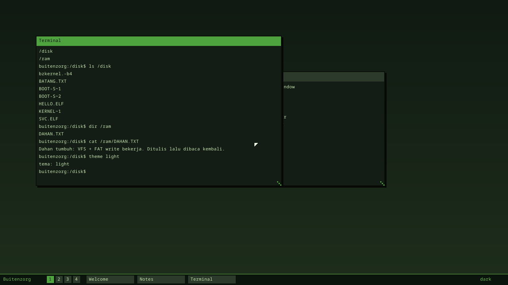
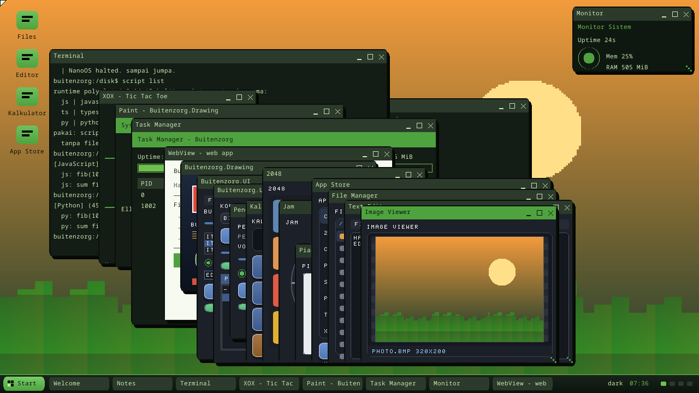

# Desktop Environment (v0.7 "Kanopi")

Milestone v0.7: **"pindah antar virtual desktop, toggle dark/light, jalankan
ls/dir di terminal"**. Dibangun di atas window manager v0.6.

[English](desktop-environment.md) · **Bahasa Indonesia** · ← [Indeks dokumentasi](README.id.md)

## Tema sistem (`theme.rs`)

Design token warna dengan dua varian: **dark** (default, hijau-daun gelap) dan
**light**. Compositor & window manager membaca warna dari `theme::current()`,
bukan hardcode. Toggle via `theme::toggle()` atau perintah `theme
dark|light|toggle`. Ini fondasi theme engine penuh (§15) yang menyusul di v0.10.

## Virtual desktop / workspace (`wm.rs`)

4 workspace. Tiap window punya field `workspace`; compositor hanya menggambar
window pada workspace aktif. `switch_workspace(n)` berpindah desktop. Wallpaper
sedikit bergeser per-desktop (fungsi `shift`). Taskbar menampilkan indikator
`[1][2][3][4]` dengan yang aktif disorot, plus tombol window workspace itu.

## Terminal + shell

| Modul | Peran |
|---|---|
| `terminal.rs` | Terminal terikat ke sebuah window: scrollback + input line, line editing, Enter menjalankan shell, body window = ekor scrollback + prompt. |
| `shell.rs` | Interpreter perintah di atas VFS/tema/wm. `run(line) -> (output, Effect)`. |
| `keyboard.rs` | Antrean input; IRQ keyboard push char, desktop loop menguras → terminal. |

**Perintah**: `help`, `ls`/`dir`, `cat`/`type`, `cd`, `pwd`, `echo`, `mounts`,
`clear`/`cls`, `ver`/`uname`, `theme [dark|light|toggle]`, `ws [1-4]`, `bz `,
dan lainnya. Alias Windows (`dir`, `type`, `cls`) dipetakan ke perilaku setara
(§14.2). Path relatif diselesaikan terhadap cwd (default `/disk`).

## Input routing

`desktop_loop` (loop akhir setelah boot):
1. Kuras `keyboard::pop()` → `terminal::feed_char` (line editing + shell).
2. Poll `mouse::state()` → `wm::handle_mouse` (move/resize window).
3. Recompose desktop bila ada perubahan.

## Verifikasi

`kanopi_demo` men-*script*-nya: menjalankan `ver`/`mounts`/`ls`/`dir`/`cat` di
terminal (assert listing memuat DAHAN.TXT → `TERMINAL OK`), toggle tema
dark→light (`THEME OK`), dan switch workspace 1→2 (`WORKSPACE OK`). Smoke test
mewajibkan marker itu; verifikasi visual di `docs/img/desktop-kanopi.png`.

## Desktop shell v0.16

Environment v0.7 tumbuh jadi desktop shell penuh di v0.16 — tombol Start dan
menu, ikon desktop, dan tray taskbar dengan jam RTC live:

## Catatan scheduler

Preemption timer **dimatikan** kecuali untuk `scheduler_demo` (v0.2). Sisanya
kooperatif (`yield_now`). Mengaktifkan preemption global saat boot task
mengerjakan render/heap berat memicu race korupsi memori — lihat CLAUDE.md.

---

← [Indeks dokumentasi](README.id.md) · *Buitenzorg OS — dibuat oleh Gravicode Studios, dipimpin oleh Kang Fadhil.*
