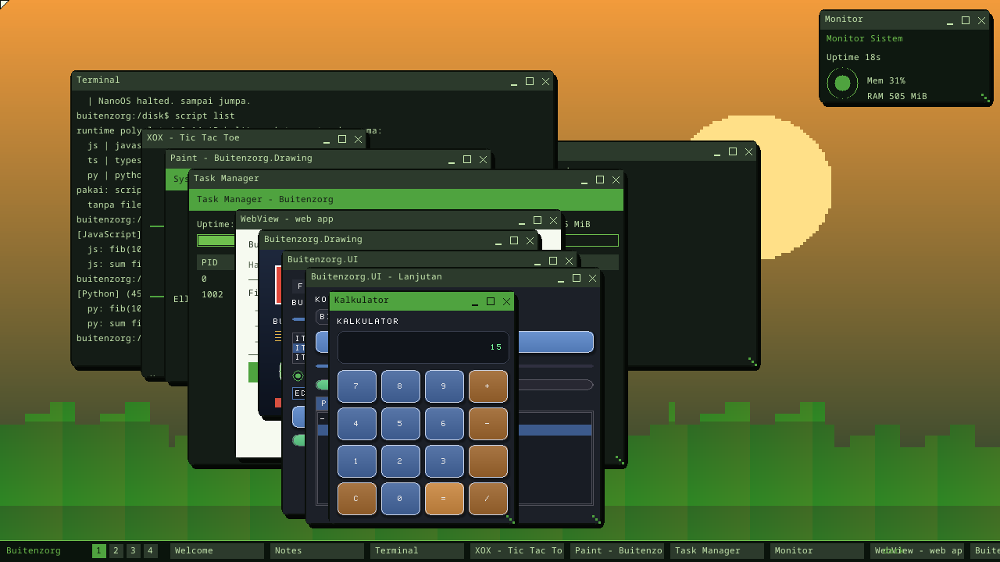
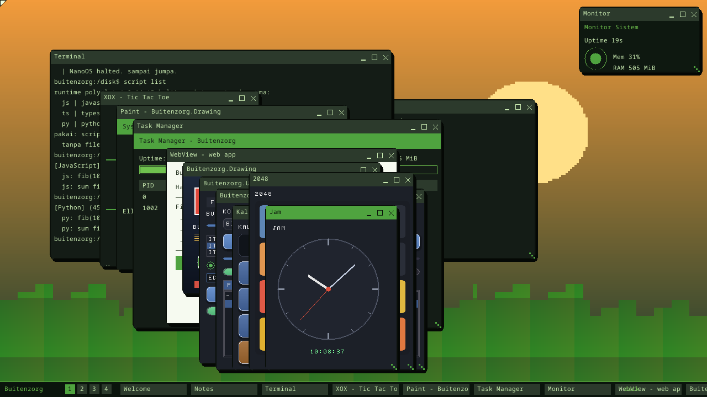
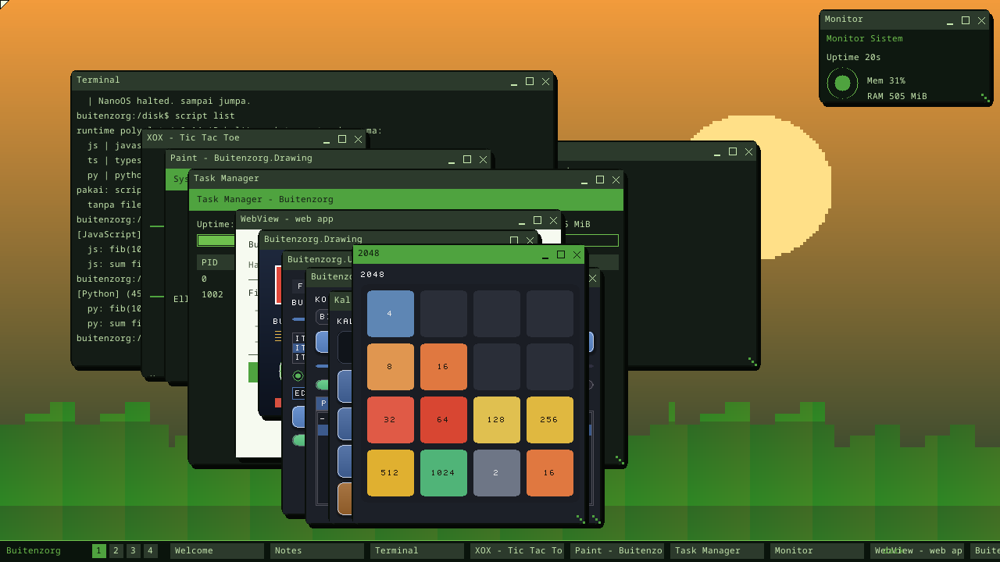
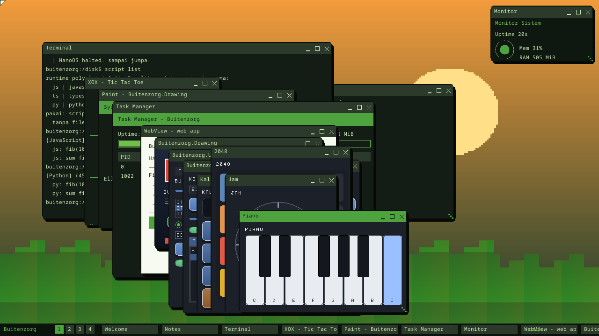
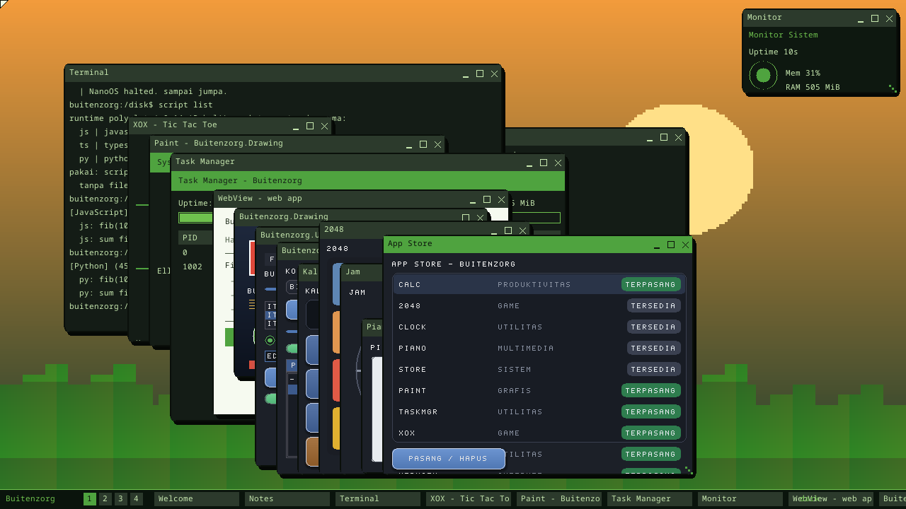
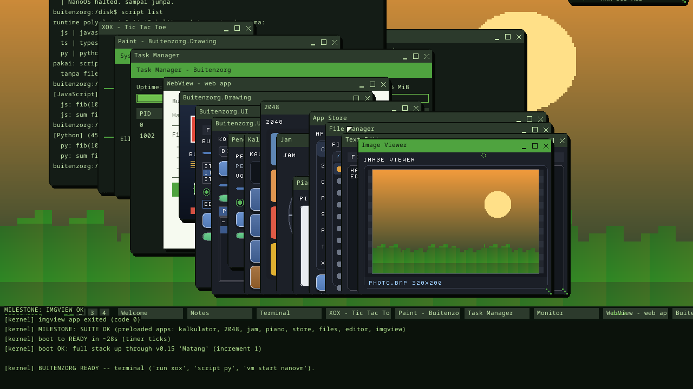

# Membuat App Pertama

App Buitenzorg ditulis dalam **C#** dan dikompilasi ke ELF native ring-3 dengan
**bflat** (`--stdlib:zero`). Sebuah app menggambar UI-nya sendiri memakai library
bawaan dan mem-blit hasilnya ke sebuah window lewat satu syscall — model
compositor ala WPF/Avalonia. Panduan ini menunjukkan dua jalur — **scaffold via
SDK** (paling cepat memulai) dan **menambah app ke image** (cara suite bawaan
dibangun) — lalu **katalog contoh** memakai library bawaan.

Prasyarat: Anda sudah bisa build & boot OS (lihat [Getting Started](getting-started.id.md)).

[English](first-app.md) · **Bahasa Indonesia** · ← [Indeks dokumentasi](README.id.md)

---

## Jalur A — Scaffold dengan SDK `bz`

```powershell
dotnet run --project sdk\bz -- new desktop-csharp MyApp
cd MyApp
dotnet run                                    # jalan di host (backend simulasi)
dotnet run --project ..\sdk\bz -- manifest validate app.manifest
```

Template tersedia: `console-csharp`, `desktop-csharp`, `js-app`, `ts-app`,
`python-app`. Ini bagus untuk mengembangkan logika di host dengan API yang sama
seperti target.

## Jalur B — Menambah app native ke image OS

Semua app bawaan (kalkulator, 2048, jam, piano, store) memakai pola ini. App ada
di `userland/hello-csharp/*.cs` dan ditautkan dengan library bawaan.

### 1. Tulis app-nya — `userland/hello-csharp/myapp.cs`

```csharp
using System;
using Buitenzorg.Drawing;
using Buitenzorg.UI;

class MyApp
{
    static void Main()
    {
        Console.WriteLine("MyApp: memulai...");         // → serial log
        Font font = Font.Default();
        UIHost host = new UIHost("MyApp", 300, 200);     // buat window 300x200

        StackPanel root = new StackPanel();
        root.Padding = 12; root.Spacing = 8;
        root.Background = new Color(0xFF1C2028);

        root.Add(new TextBlock("HALO DUNIA", font));
        Button b = new Button("KLIK", font); b.Width = 120; b.Height = 30;
        root.Add(b);

        host.Root = root;
        host.Layout();                                   // hitung tata letak
        host.Render(new Color(0xFF141820));              // gambar ke Bitmap
        host.Present();                                  // blit ke window

        Console.WriteLine("MILESTONE: MYAPP OK");        // marker (opsional)
    }
}
```

### 2. Daftarkan di build & di kernel

- **`scripts/build-hello-csharp.ps1`** (dan `.sh`): tambahkan program ke daftar,
  mis. `@{src=@("myapp.cs","bzui.cs","bzgfx.cs"); elf="myapp.elf"}`.
- **`kernel/bzimage/build.rs`**: tambahkan `("myapp.elf","myapp.elf")` agar ELF
  ter-embed di image.
- **`kernel/bzkernel/src/app.rs`** (`app_file`): petakan nama → file 8.3, mis.
  `"myapp" => Some("MYAPP.ELF")` (nama ≤ 8 karakter, huruf besar).

### 3. Jalankan

- Dari shell OS setelah boot: `run myapp`
- Atau panggil `app::run_named("myapp")` di sebuah demo `kernel_main` agar jalan
  saat boot (dan marker `MILESTONE:`-nya bisa dicek smoke test).

Build ulang + boot: `scripts\build-hello-csharp.ps1`, lalu
`cargo run --release -p bzimage -- --run`.

## Library bawaan

Tautkan file `.cs` library yang relevan saat build (lihat langkah 2 di atas).

### `Buitenzorg.Drawing` (`bzgfx.cs`) — grafik 2D

Renderer software sisi-klien (gaya System.Drawing). `Bitmap` (buffer ARGB) +
`Graphics`: `FillRectangle` / `FillRoundedRectangle` (sudut anti-alias),
`FillRoundedGradientV`, `DrawShadow` (drop shadow), `DrawLine` (tebal),
`DrawCircle` / `FillCircleAA`, `FillEllipse`, `FillPolygon`, `FillGradientV/H`,
`DrawImage` / `DrawImageScaled`, transform 2D (`Matrix`, `RotateTransform` +
`SinFx` / `CosFx`), `GraphicsPath`, clipping (`SetClip`), `FillHatch`, BMP 24-bit
(`Bmp.Save/Load`), JPEG baseline (`Jpeg.Load`), dan `Font` 8×8 (`DrawString`,
`DrawChars`, `MeasureString`).

```csharp
Bitmap bmp = new Bitmap(200, 120);
Graphics g = new Graphics(bmp);
g.FillGradientV(0, 0, 200, 120, Color.FromRgb(40,60,90), Color.FromRgb(10,15,25));
g.FillRoundedGradientV(20, 20, 120, 40, 8, Color.FromRgb(96,150,220), Color.FromRgb(48,88,150));
g.DrawString(Font.Default(), "HALO", Color.White, 30, 30);
```

### `Buitenzorg.UI` (`bzui.cs`) — toolkit retained-mode (butuh `bzgfx.cs`)

Visual tree `UIElement` + pass layout `Measure/Arrange`. Layout: `StackPanel`,
`Grid` (fixed/star), `Canvas`, `Border`. Kontrol: `TextBlock`, `Button`,
`CheckBox`, `ProgressBar`, `Slider`, `RadioButton` (+`RadioGroup`), `ListBox`,
`TextBox`, `Menu`, `ComboBox`, `TabControl`, `TreeView`, `ScrollViewer`,
`DataGrid`. `UIHost` adalah compositor: `Layout()` / `Render()` / `Present()` +
`Mouse(x,y,down)` untuk routing event (hover/klik/drag) & popup.

```csharp
Grid grid = new Grid();
grid.AddColumn(-1); grid.AddColumn(-1);   // dua kolom "star"
grid.AddRow(-1);
Button b = new Button("OK", font); b.GridRow = 0; b.GridCol = 0;
grid.Add(b);
```

> **Klik tombol** tidak punya event. `Button` mengekspos `int Clicks` (naik tiap
> klik) dan `int Tag`; reaksi dengan memanggil `host.Mouse(...)` lalu cek apakah
> `Clicks` bertambah. Lihat `calc.cs` untuk pola lengkapnya.

### `Buitenzorg.Audio` (`bzaudio.cs`) — audio (butuh driver AC'97 di kernel)

`Mixer`: `GetInfo`, `SetVolume(0..100)`, `Mute`, `Beep(freqHz, ms)`,
`Play(short[] pcm, count)`. `Tone.Square(...)` membangkitkan gelombang.

```csharp
Mixer.SetVolume(70);
Mixer.Beep(440, 200);           // A4 selama 200 ms
```

### `Buitenzorg.Bcl` (`bzbcl.cs`) — koleksi / teks / encoding gaya .NET

`BzList<T>`, `BzStack<T>`, `BzQueue<T>`, `BzIntMap<V>`, `BzStrMap<V>`,
`BzIntSet`, `BzRefList<T>`, `BzSort`, operator gaya LINQ
(`Where/Select/Sum/Count/Any/All/Max/Min/First/Last/Take/Skip/...`),
`BzStringBuilder`, `BzMath`, `BzRandom`, `BzConvert`, `BzStr`, `BzHex`,
`BzBitConverter`, `BzBase64`.

### `Buitenzorg.Bcl` bagian 2 (`bzbcl2.cs`) — namespace .NET lainnya

Tambahkan **`bzbcl.cs` dan `bzbcl2.cs`** ke daftar sumber app untuk memakai ini.

| Namespace .NET | Tipe | Contoh |
|---|---|---|
| `System.IO` | `BzPath`, `BzFile`, `BzDir`, `BzMemoryStream` | `BzFile.ReadAllChars("/disk/A.TXT", 4096, out t)` · `BzFile.WriteAllChars("/ram/N.TXT", t, n)` |
| `System.Text` | `BzEncoding` | `BzEncoding.Utf8GetBytes(chars, n, bytes)` |
| `System.Text.RegularExpressions` | `BzRegex` | `new BzRegex("^[0-9]+$").IsMatch("123")` |
| `System.Globalization` | `BzCulture`, `BzDateTime` | `BzCulture.FormatGrouped(1234567, buf)` · `BzDateTime.Now()` |
| `System.Diagnostics` | `BzStopwatch`, `BzProcess`, `BzDebug` | `BzProcess.GetProcesses(64)` · `BzProcess.Kill(pid)` |
| `System.Management` | `BzSystemInfo` | `BzSystemInfo.Query().UptimeSeconds` |
| `System.Net(.Sockets)` | `BzIPAddress`, `BzSocket`, `BzNetInfo` | `sock.SendTo(ip, 7000, "halo")` (UDP, loopback) |
| `System.Net.Http` | `BzHttp` | `BzHttp.BuildGet(host, path, buf)` — *lapisan pesan saja, TCP belum ada* |
| `System.Threading.Tasks` | `BzTask`, `BzMutex` | `BzTask.Run(&Worker, arg)` — body-nya **function pointer**, bukan delegate |
| `System.Timers` | `BzTimer` | `timer.Start(); if (timer.Poll()) { ... }` (di-poll dari loop app) |
| `GC` | `BzGC` | `BzGC.GetAllocatedBytes()` — `Collect()` mengembalikan `false` (heap bump-only) |
| `Pkg` | `BzPkg` | `BzPkg.List(32)` · `BzPkg.Install(pkg)` |

Pemakaian nyata ada di suite app: `clock.cs` (BzDateTime),
`taskmgr.cs` / `widget.cs` (BzProcess/BzSystemInfo), `store.cs` (BzPkg),
`filemgr.cs` (BzDir), `imgview.cs` / `editor.cs` (BzFile/BzPath).

## Ide contoh app (semua bisa dibuat sekarang)

| App | Library utama | Pola |
|---|---|---|
| **Kalkulator** | UI (Grid + Button) | `calc.cs` — dispatch klik via `Button.Tag` ke engine |
| **Game (2048 / Snake / puzzle)** | Drawing + UI | papan `UIElement` custom + logika di value-array |
| **Jam** | Drawing (Matrix/AA) | jarum via `SinFx/CosFx`, digital via `DrawChars` |
| **Piano / musik** | UI + Audio | tuts → `Mixer.Beep(freq)` |
| **App Store** | UI (DataGrid) + syscall PKG | katalog dari `PKG_LIST`, install via `PKG_SET` |
| **Text editor** | UI (`TextBox`/`Menu`) | area teks + menu (butuh input keyboard) |
| **Image viewer** | Drawing + Bcl | `BzFile.ReadAllBytes` → `Bmp.Load`/`Jpeg.Load` + `DrawImageScaled` |
| **Dashboard sistem** | UI + Bcl | `BzSystemInfo`/`BzProcess` → `DataGrid`/`ProgressBar` |

Lihat kode nyata di `userland/hello-csharp/` (`calc.cs`, `game2048.cs`,
`clock.cs`, `piano.cs`, `store.cs`) untuk contoh lengkap.

| | | |
|---|---|---|
|  |  |  |
|  |  |  |

## ⚠️ Batasan zerolib (penulis app wajib baca)

App freestanding memakai zerolib (belum ada GC penuh). Yang **tidak** berfungsi:

- **Static field bertipe referensi** membaca sampah (GC statics belum di-init) →
  simpan state di **field instance / lokal**, bukan `static` ref.
- **`new string(...)` / `ToString()` / concat string dinamis** → bangun teks ke
  `char[]` / `stackalloc` lalu `Graphics.DrawChars`.
- **`string == string`** butuh `op_Equality` (tak ada) → banding by-reference
  atau char demi char.
- **Menyimpan referensi ke elemen `object[]`** (`stelem.ref`) fault → pakai
  **linked list** (store ke field objek), bukan array-of-object.
- **Konversi method-group → delegate** (di-cache di GC static) fault → pakai
  **function pointer** `delegate*<...>` + `&Method`.

Yang **berfungsi**: `new`, array nilai (`int[]`, `short[]`), objek heap, generic,
virtual dispatch, `stackalloc`. Detail lengkap di `CLAUDE.md`.

---

← [Indeks dokumentasi](README.id.md) · *Buitenzorg OS — dibuat oleh Gravicode Studios, dipimpin oleh Kang Fadhil.*
