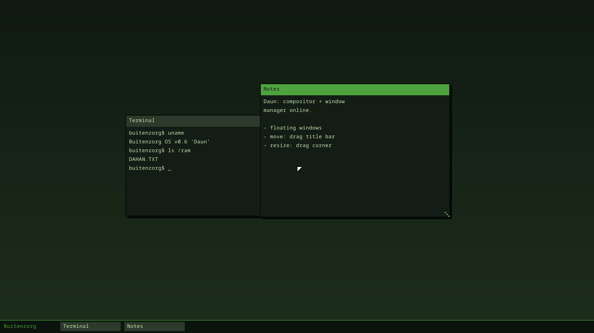
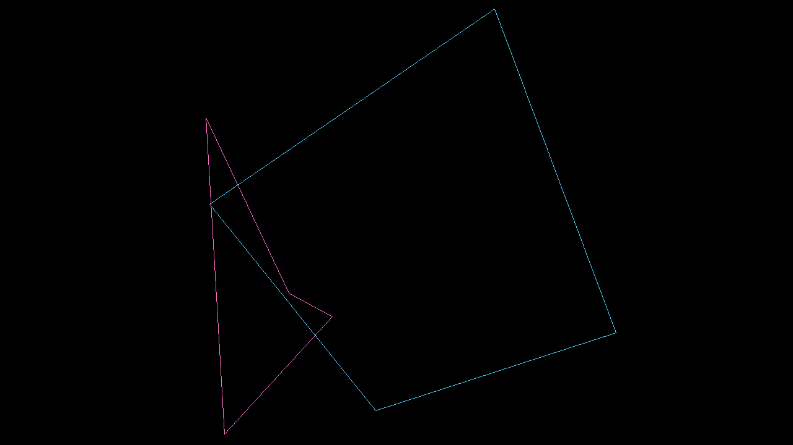

# Graphics & Window System (v0.6 "Daun")

Milestone v0.6: **"dua window bisa dipindah & di-resize"**. Kernel merender
desktop berjendela ke framebuffer dan merutekan event mouse ke window.

[English](window-system.md) · **Bahasa Indonesia** · ← [Indeks dokumentasi](README.id.md)

## Lapisan

| Modul | Peran |
|---|---|
| `gfx.rs` | Primitif render ke buffer `0x00RRGGBB`: `fill_rect`, `rect_outline`, `fill_gradient`, alpha `blend`, teks (font Noto). |
| `wm.rs` | Window manager + compositor: window floating, z-order, hit-test, move/resize, taskbar, kursor. |
| `framebuffer::present` | Blit back-buffer full-screen ke hardware framebuffer (konversi ke format piksel BGR/RGB). |

## Compositor

Double-buffered: tiap frame dirender penuh ke back-buffer (`Vec<u32>` seukuran
layar), lalu `present` menyalinnya sekali ke framebuffer (tanpa flicker). Urutan
gambar: wallpaper gradien → window (belakang→depan, dengan drop shadow, title bar,
teks, border, resize grip) → taskbar → kursor.

## Window manager

- **Window floating**: `create_window(title, x, y, w, h, lines)`.
- **Z-order**: `Vec<Window>` belakang-ke-depan; klik menaikkan window ke atas.
- **Hit-test**: `window_at(x, y)` mengembalikan window teratas di titik itu.
- **Move**: tekan di title bar → drag → window mengikuti kursor (offset tetap).
- **Resize**: tekan di grip kanan-bawah (`RESIZE_GRIP` px) → drag → ukuran berubah
  (dibatasi `MIN_W`/`MIN_H` dan tepi layar).

## Event routing

`handle_mouse(x, y, left)` menerima satu sampel mouse (posisi absolut + tombol
kiri), mendeteksi tepi press/release, memulai/melanjutkan/mengakhiri drag.
Sumbernya bisa:
- **Mouse PS/2 nyata** (`desktop_loop`): poll `mouse::state()`, recompose saat
  pointer bergerak atau tombol berubah.
- **Event ter-script** (`daun_demo`): urutan `handle_mouse` untuk memindah satu
  window dan me-resize window lain, lalu memverifikasi geometrinya berubah
  (`window_rect`) — inilah yang membuat milestone teruji headless di CI.

## Verifikasi

`daun_demo` mencetak perubahan geometri, lalu `MILESTONE: WINDOWS OK`, dan smoke
test mewajibkan marker itu di semua media boot. Verifikasi visual lewat screenshot
QEMU:

## v0.11 "Cahaya": kontrol window, screensaver, personalisasi, micro-interaction

- **Kontrol window** (`wm.rs`): tombol **minimize/maximize/close** di tiap title
  bar, state normal/minimized/maximized (restore/focus dari taskbar), dan **sudut
  membulat** (per-tema; tema beveled tetap kotak).
- **Screensaver** (`screensaver.rs`): 6 saver gaya Win 3.1/98 (Starfield, Mystify,
  3D Pipes, Marquee, Bouncing, Blank), aktif setelah idle ~12 detik
  (`desktop_loop`), dismiss saat ada input. Pilih dengan `saver <nama|list|off>`.

  

- **Wallpaper** (`wallpaper.rs`): bawaan (theme/waves/grid/dots/aurora) + **gambar
  user** (BMP 24-bit dari VFS). Pilih dengan `bg <nama|/path.bmp|list>`.
- **Micro-interactions**: hover highlight di tombol kontrol, **click ripple**
  beranimasi, loop desktop kontinu. Matikan dengan `anim off`.
- **Personalisasi** via shell: `settings`, `bg`, `saver`, `cursor`, `anim`,
  `theme`.
- **Compute API** (`compute.rs`): backend CPU dengan interface siap-GPU.

> Catatan penting: `desktop_loop` butuh timer hidup. `usermode::enter_user`
> me-*re-enable* interrupt setelah app ring-3 keluar (IF dulu tetap mati → timer
> mati → desktop interaktif/screensaver/animasi rusak sejak v0.4).

## Berikutnya

Tata letak tiling, animasi buka/tutup window, transisi tema/workspace, app
Personalisasi GUI, dan driver GPU nyata (compositor dipercepat GPU).

---

← [Indeks dokumentasi](README.id.md) · *Buitenzorg OS — dibuat oleh Gravicode Studios, dipimpin oleh Kang Fadhil.*
