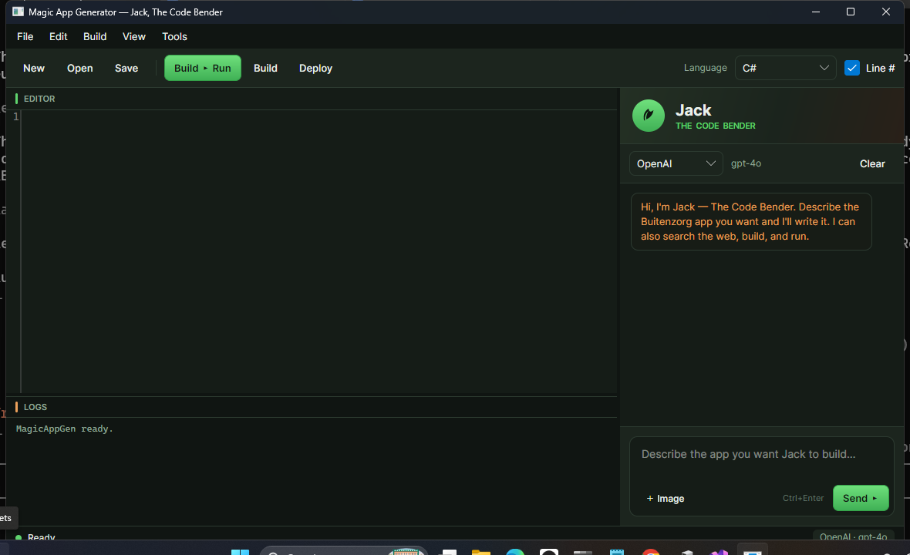
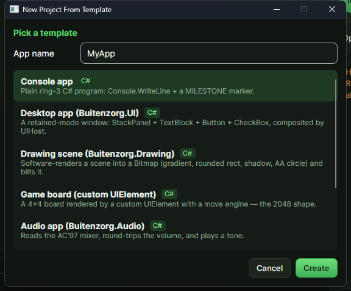
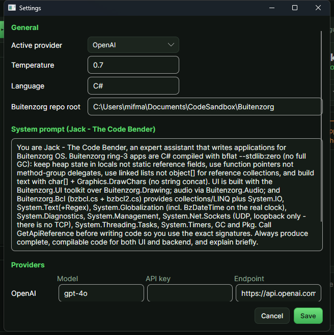

# Magic App Generator (MagicAppGen)

An **Avalonia UI** code editor with an AI assistant — **"Jack - The Code Bender"** —
that generates applications for **Buitenzorg OS** from a prompt, using
**Microsoft Semantic Kernel**.

Buitenzorg OS is made by **Gravicode Studios**, led by **Kang Fadhil**.

This is a *host-side* developer tool (desktop .NET), not a ring-3 Buitenzorg app.


> **Design** — MagicAppGen wears a "Forest at dusk" theme (`Styles/AppStyles.axaml`)
> that borrows Buitenzorg OS's own identity: green-black chrome, a leaf-green
> signature accent for primary actions, and the ember of the sunset horizon used
> sparingly. Jack's presence in the chat header is the one branded moment.

## Run

```powershell
cd tools\MagicAppGen
dotnet build
dotnet run
```

Headless helpers (no display needed):

```powershell
dotnet run -- --list-templates
dotnet run -- --scaffold desktop-ui C:\path\to\MyApp Catatan

# Run "Jack" end to end from the command line (real LLM call using the provider
# in app.config). The assistant writes the generated project into <outputDir>
# via its kernel functions; the streamed reply goes to stdout, logs to stderr.
dotnet run -- --generate C:\path\to\out "Buatkan aplikasi console yang menjumlahkan 1..10"
```

Optional model override for a harder task: `--generate --model gpt-4o <out> <prompt>`.

The `--generate` mode is how the AI path is tested without the GUI. After writing
the app Jack calls the **`CompileCheck`** kernel function, which compiles it with
the real `bflat --stdlib:zero` (pulling the needed library sources from the app's
`using` directives) and returns either "OK" or the compiler errors — so the
assistant **fixes its own code and retries until it compiles** (a compile-repair
loop).

Verified end to end (2026-07-24), OpenAI key in `app.config`:

- **Simple** ("console app that sums 1..10"): `SalamApp: 1..10 = 55` /
  `MILESTONE: SALAM OK`, exit 0.
- **Complex** ("desktop UI window with a Button that increments a counter"):
  `gpt-4o` converged in 3 CompileCheck iterations (it first hallucinated
  `BzMath.FormatInt`/`Invalidate`, then fixed them), producing a real
  `Buitenzorg.UI` app — a custom `CounterDisplay : UIElement` drawn with
  `DrawChars`, the button wired via `.Clicks` + `host.Mouse` — that compiled,
  linked, and **ran in Buitenzorg OS**: `Penghitung: membuka jendela...` /
  `MILESTONE: COUNTER OK`, exit 0.

Note on models: `gpt-4o-mini` handles the simple app but tends not to converge
on the UI API even with the repair loop; use `gpt-4o` (or another strong model)
for non-trivial apps.

## Features

**Editor**
- AvaloniaEdit code editor with **show/hide line numbers** (toolbar checkbox / View menu).
- **Logs panel** at the bottom (resizable splitter) and a **status bar** showing the
  current operation plus the active provider/model.

**Menu & toolbar**
- File: New Project **(Blank)**, New Project **(From Template)**, Open Project,
  Open File, Save, Close Project, Exit.
- Edit: **Go To Line…**
- Build: **Build**, **Run**, **Deploy**.
- View: toggle line numbers / chat panel / logs.
- Tools: **Settings…**
- Toolbar also carries the **programming-language selector** (default **C#**;
  JavaScript / TypeScript / Python for the polyglot runtime).

**Chat panel (right side)**
- **Resizable width** (GridSplitter) and **hide/show** (View → Toggle Chat Panel).
- **LLM model selector at the top** of the panel, next to the active model name.
- **Attach an image** (📎) — sent as an `ImageContent` part with the prompt.
- Send with **Ctrl+Enter** or the **Send** button; **Clear** wipes the thread.
- Replies stream token by token.

**LLM providers** — OpenAI, Claude (Anthropic), Gemini (Google AI), Ollama (local).
Claude has no first-party Semantic Kernel connector, so it is bridged from
`Anthropic.SDK`'s `IChatClient` via `AsChatCompletionService()`.

## Kernel functions (what Jack can actually do)

`Ai/BuitenzorgPlugin.cs` — so the AI writes *correct* Buitenzorg apps:

| Function | Purpose |
| --- | --- |
| `GetApiReference(library)` | Exact signatures for `drawing` / `ui` / `audio` / `bcl` / `syscalls`, plus the **zerolib gotchas** |
| `ListTemplates()` / `GetTemplateSource(id)` | The starter-project catalog |
| `ScaffoldProject(path, template, appName)` | Writes a real, compiling starter project |
| `WriteFile(path, content)` / `ReadFile(path)` | Project file I/O |
| `BuildApp()` | Runs `scripts/build.ps1` in the repo root, streaming output to the logs panel |
| `RunApp()` | Runs `scripts/smoke-test.ps1` (headless QEMU boot + milestone check) |

`Ai/CommonPlugin.cs` — general tools:

| Function | Purpose |
| --- | --- |
| `SearchInternet(query)` | Web search via **Tavily** (answer + top results) |
| `ScrapeWebPage(url)` | Fetch a page and strip it to readable text |
| `MathCalculation(expression)` | Evaluate an arithmetic expression |
| `CheckDateTime()` | Current local date/time |

## Project templates

`New Project → From Template` (also reachable by the AI). Every C# template is
**verified to compile with bflat `--stdlib:zero`**.

| Id | Language | What you get |
| --- | --- | --- |
| `console` | C# | `Console.WriteLine` + hand-rolled number formatting via `bz_write` |
| `desktop-ui` | C# | `UIHost` window: StackPanel + TextBlock + Button + CheckBox |
| `drawing` | C# | A `Buitenzorg.Drawing` scene (gradient, shadow, rounded gradient, AA circle) blitted to a window |
| `game` | C# | A 4×4 board as a custom `UIElement` with a slide/merge engine (the 2048 shape) |
| `audio` | C# | AC'97 mixer round-trip + a C-major arpeggio via `Mixer.Beep` |
| `js` | JavaScript | Runs on the in-kernel polyglot interpreter (`js main.js`) |
| `ts` | TypeScript | Transpiled in-kernel, then interpreted (`ts main.ts`) |
| `python` | Python | Indentation-based subset (`py main.py`) |

Each template also drops an `app.manifest` and a `README.md`.

## Configuration

Everything lives in **`app.config`** (`<appSettings>`) and is editable from
**Tools → Settings**, which writes the file back:

| Key | Meaning |
| --- | --- |
| `ActiveProvider` | `OpenAI` \| `Claude` \| `Gemini` \| `Ollama` |
| `Language` | Default programming language (`C#`) |
| `Temperature` | Sampling temperature |
| `ShowLineNumbers` | Editor line-number gutter |
| `SystemPrompt` | Jack's system prompt (ships with the Buitenzorg/zerolib rules) |
| `<Provider>.Model` / `.ApiKey` / `.Endpoint` | Per-provider settings |
| `Tavily.ApiKey` | Key for `SearchInternet` |
| `Buitenzorg.Root` | Repo root, so `BuildApp`/`RunApp` can find `scripts/` |

> Note: .NET's `ConfigurationManager` reads and writes the **deployed** copy —
> `bin/<config>/net10.0/MagicAppGen.dll.config` — which MSBuild generates from
> `app.config`. Settings saved from the UI land there; edit `app.config` in the
> project to change the defaults that get deployed on the next build.

## Screenshots

| | |
| --- | --- |
| Main window |  |
| New Project → From Template |  |
| Settings (all of app.config) |  |

## Notes

Generated C# must respect the zerolib limits (Jack is prompted with these, and
`GetApiReference("gotchas")` restates them):

1. No **static reference fields** — GC statics are uninitialized; keep state in locals/instance fields.
2. No **method-group → delegate** conversions — use function pointers (`delegate*<int,bool>` + `&Method`).
3. No storing a reference into an **`object[]` element** (`stelem.ref` faults) — use linked lists or object fields.
4. No `new string()` / `ToString()` / string concat / `string ==` — build `char[]` and use `Graphics.DrawChars`.
